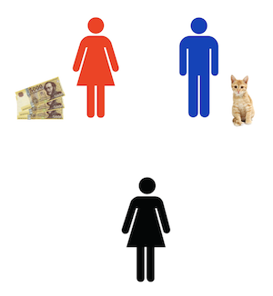

# Marlowe as a Haskell data type

This tutorial examines how a Haskell data type can be used to describe a contract, first in the abstract, and then in the blockchain context using Marlowe.

## A simple escrow contract




Suppose that `alice` wants to buy a cat from `bob`, but neither of them trusts the other. Fortunately, they have a mutual friend `carol` whom they both trust. They therefore agree on the following contract, written using simple functional pseudocode. This kind of contract is a simple example of _escrow_.
```haskell
(When (Or (two_chose alice bob carol refund)
          (two_chose alice bob carol pay))
      (Choice (two_chose alice bob carol pay)
              (Pay alice bob AvailableMoney)
              redeem_original))
```              
The contract is described using the _constructors_ of a Haskell data type. The outermost constructor `When` has two arguments: the first is an _observation_ and the second is another contract. The intended meaning of this is that _when_ the observation becomes true, the second contract is executed.

The observation here is a disjunction: it is true if two of the participants (presumably `carol` the trusted intermediary, and `bob`) agree that `bob` should be paid, or if two (in this case `carol` and `alice`) agree that `alice` should be refunded.

The second contract is itself a `Choice` depending on whether or not there has been agreement to pay `bob`. If that is indeed the case, then the payment is offered to `bob`; if not, then a refund is offered to `alice`.

```diff
- Exercise
```


## Where to go to find out more

- SPJ original paper
- Patrick Barr paper
