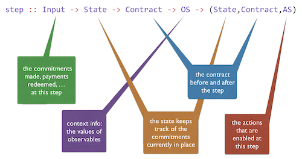

# The semantics of Marlowe

This tutorial gives a formal semantics for Marlowe by presenting a Haskell definition of the semantic `step` function, so that we have a _semantics that we can execute_. 

## Marlowe

As a reminder Marlowe domain-specific language (DSL) is modelled as an algebraic type in Haskell. 

```haskell
data Contract =
   Null |
   CommitCash IdentCC Person Money Timeout Timeout Contract Contract |
   RedeemCC IdentCC Contract |
   Pay IdentPay Person Person Money Timeout Contract |
   Both Contract Contract |
   Choice Observation Contract Contract |
   When Observation Timeout Contract Contract
```

## The step function
 

### Computation 

Computation is modelled at two different levels.

The step function represents a single computation step and has this type:
```haskell
step :: Input -> State -> Contract -> OS -> (State,Contract,AS)
```
which is also illustrated here: 



The `step` function is total, so that for every contract a result of stepping is defined. However, for some kinds of contracts – commits, redeems or time-shifted contracts – it is possible that performing a step produces the same contract as the result; we call these _quiescent_ steps whereas all others make progress. We use this distinction in the explanation that follows.

Execution of a contract will involve multiple blocks, with multiple steps in each block. The computation at a single block is given by the `stepBlock` function: this will call the `stepAll` function that calls `step` repeatedly until it is quiescent.
In addition to calling `stepAll`, `stepBlock` will first enable expired cash commitments to be refunded and record, in the state, any choices made at that step. The functions `stepAll` and `stepBlock` have the same type as `step` itself.


## Where to go to find out more 
- blah

### [Prev](./marlowe-data.md) [Up](./Tutorials.md) [Next]()